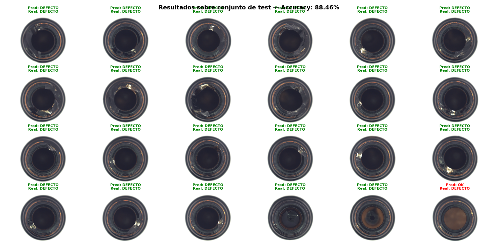

# Detección de defectos industriales con visión artificial

Clasificador binario que detecta defectos en superficies industriales 
usando **EfficientNet-B0 con transfer learning**, entrenado sobre el 
dataset público MVTec AD (categoría: bottle).

Desarrollado como proyecto personal para aprender visión artificial 
aplicada a entornos industriales.

## Resultados

**88-92% de precisión** sobre el conjunto de test.

## Tecnologías

- Python
- PyTorch + torchvision
- EfficientNet-B0 (transfer learning)
- Dataset: MVTec AD

## Cómo ejecutarlo

1. Descarga el dataset MVTec AD (categoría bottle) desde [mvtec.com](https://www.mvtec.com/company/research/datasets/mvtec-ad)
2. Instala las dependencias: `pip install torch torchvision matplotlib pillow`
3. Ajusta la variable `ruta` en `siali_project.py` con tu ruta local
4. Ejecuta el script: `python siali_project.py`

## Contexto

Proyecto desarrollado con el objetivo de entender cómo se aplica 
la visión artificial en el control de calidad industrial, un problema 
real que empresas como Siali Technologies están resolviendo con deep learning.
